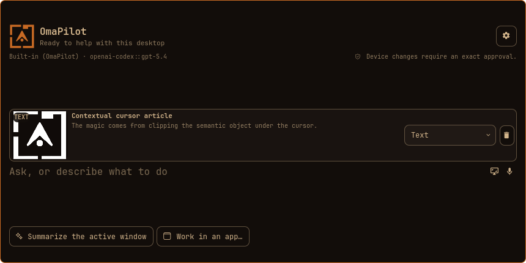

# OmaPilot for Omarchy

OmaPilot is a native [Omarchy Quattro](https://github.com/basecamp/omarchy/tree/quattro) bar widget and contextual-capture overlay for asking questions and working on your desktop through an authenticated AI harness. It can summarize the active window, research current information, clip a window or exact region, work through bounded app connectors, remember your recent completed chats, and hand a conversation to Herdr when you want to keep going.

This fork carries the `0.2.1-rbart.1` community build under OmaPilot's permanent
plugin ID `io.github.spencerbull.omapilot`. Spencer Bull remains the original
author of OmaPilot; the selected-text actions and this maintained community
build are contributed by [@r-bart](https://github.com/r-bart). Plugin, IPC,
package, runtime, and user-data identifiers remain in the OmaPilot namespace so
the fork stays compatible with upstream and can contribute changes back.

## Preview


Ambient voice stays out of the way until it has something useful to show. The
listening surface above is the real animated `VoiceNode` component recorded on
an isolated blank workspace.



The new-chat screen is rendered from the current QML components against the
pinned Omarchy Quattro imports with `npm run preview`; the same panel and
components are exercised by the UI contract suite and verified in the live
shell.

The compact composer expands from the right side of the bar. Device changes
stay behind an exact, inspectable approval unless you explicitly enable
**Dangerous auto-approve** in settings. Its result panel
supports selectable Markdown, code blocks, tables, safe clickable links,
bounded images, Copy, New chat, History, and Continue in Herdr. The in-panel
settings pane can add, edit, remove, and reorder up to five quick actions.
Built-in follow-ups resume the same durable Pi conversation until **New chat**
is selected, including after the shell restarts. **Continue in Herdr** opens
that same Pi session with OmaPilot's private auth and session directories.
Waiting and streaming use one theme-native perimeter runner around the response
surface. One GPU-blurred accent form replaces the old route glyph without a
separate hard stroke or fake progress; phase changes never restart the runner,
and reduced motion keeps the ordinary static border. First-token
content, panel growth, and follow-latest scrolling transition smoothly, while a
compact error notice opens an inspectable details pane.

## Requirements

- Omarchy Quattro with the native shell plugin architecture.
- Linux x86-64 for the initial prebuilt runtime.
- Node.js 22 or newer. The checked-in Linux launchers contain the reviewed
  broker and Codex ACP payloads but execute them with the system Node runtime.
- Credentials for the built-in harness, or an installed and authenticated ACP harness.
- Optional: Voxtype for dictation and Herdr for durable continuation.
- Optional: a TTS provider to speak answers. ElevenLabs is the guided default
  and needs an API key entered in Settings. Kokoro is local
  (`pip install kokoro soundfile` on Python 3.10–3.12, plus `espeak-ng`), while
  OpenAI also needs an API key. Cloud keys are stored
  in `~/.config/omapilot/voice-auth.json`, not widget settings. Voice stays
  off until enabled there.
- `wl-clipboard` to read the selection for text actions, and `wtype` to type a
  correction back into the window it came from.
- `grim` for contextual screenshots. ImageMagick, already used by OmaPilot's
  image policy, validates and normalizes every captured image.
- Optional: Tesseract adds text-under-the-pointer extraction and the **Text**
  representation. Without it, screenshot and browser-element capture still work.

OmaPilot includes a native Pi-based harness for Codex subscription, OpenAI API,
Grok, and configured OpenAI-compatible endpoints. It resolves credentials from
environment variables or `${XDG_CONFIG_HOME:-$HOME/.config}/omapilot/auth.json`,
discovers shared `~/.agents` skills, Omarchy's official `~/.pi/agent/skills`
root, bundled OmaPilot skills, and named agents. It exposes Pi's standard coding
tools plus verified app, window, workspace, and monitor controls behind
OmaPilot's approval broker. See [Native Pi harness configuration](docs/native-harness.md).
The Harness setting explicitly selects **Built-in (OmaPilot)**, **Codex**, or
**OpenCode**. The latter two are ACP harnesses and must already
be installed and signed in. OmaPilot never substitutes one harness for another.
When Built-in has no configured credential, its settings card offers
subscription and API-key sign-in methods. OmaPilot runs Pi's typed login flow
inside the broker, opens the provider's browser page for OAuth when needed, and
renders provider choices, device codes, progress, and errors in Settings.
Browser OAuth completes through a broker-owned localhost callback; callback
URLs are never user input. It never opens the Pi terminal.

After authentication, the empty conversation shows the next first-run step:
configure Voice with ElevenLabs, then open Desktop settings and explicitly press
**Install global hotkeys**. Chat remains usable throughout; setup never edits
Hyprland configuration without that final button press.

## Install

Review the repository before enabling it: Omarchy plugins execute unsandboxed inside the long-lived shell process.

### Community build

The default branch of `r-bart/omarchy-omapilot` is the tested, installable
community release. It includes selected-text Fix, Rewrite, Translate, custom
instructions, Before/After review, and explicit replacement.

```bash
omarchy plugin add https://github.com/r-bart/omarchy-omapilot.git
omarchy plugin validate ~/.config/omarchy/plugins/io.github.spencerbull.omapilot
omarchy plugin enable io.github.spencerbull.omapilot right
```

### Upstream build

Install Spencer Bull's upstream repository when you want the official upstream
state instead of the community release:

```bash
omarchy plugin add https://github.com/spencerbull/omarchy-omapilot.git
omarchy plugin validate ~/.config/omarchy/plugins/io.github.spencerbull.omapilot
omarchy plugin enable io.github.spencerbull.omapilot right
```

The Omarchy installer only clones, validates, and enables the plugin. Omarchy
runs no plugin install hook, and OmaPilot does not request administrator access
or invoke a package manager. Installation and first load do not edit Hyprland
configuration. To add the described global shortcuts, explicitly choose
**Settings → Desktop → Install global hotkeys**. OmaPilot then adds one marked
block to `~/.config/hypr/bindings.lua` while preserving every shortcut chord
already defined there. The reviewed repository revision includes
reproducible Linux x86-64 broker and Codex ACP launchers, so a normal install
does not run `npm`, `npx`, or silently download executable code. The launchers
execute their embedded JavaScript payloads directly from the read-only launcher
file with system Node;
Git history anchors those generated files to their TypeScript source and pinned
lockfile. Release archives add an SBOM, provenance record, and SHA-256 checksum.

The fork uses `main` for public, validated releases and `develop` for integrated
work awaiting the next release. Feature branches stay isolated. Contributions
intended for Spencer's repository are rebuilt as focused branches from
`origin/main` or `origin/dev`, rather than asking upstream to merge the fork's
entire downstream history. See [Community fork maintenance](docs/community-fork.md).

Update or remove it with the standard plugin commands:

```bash
omarchy plugin update io.github.spencerbull.omapilot
omarchy plugin remove io.github.spencerbull.omapilot
```

Restart the shell after an update that adds an IPC action:

```bash
omarchy-restart-shell
```

OmaPilot's store is a QML singleton, and a singleton outlives the plugin
reload that a changed file triggers. The old object keeps the IPC handler it
was built with, so an action added by the update answers `Function not found.`
until the shell is restarted — and because the installed bindings call
`omarchy-shell -q`, that answer is swallowed and the new chord simply does
nothing.

## Global hotkeys

OmaPilot exposes compositor-safe IPC actions for a contextual voice session,
forced-fresh typed or voice conversations, and handing the current chat to
Herdr. Choose **Settings → Desktop → Install global hotkeys** to add these
bindings to `~/.config/hypr/bindings.lua`, where their descriptions appear in
**Learn → Keybindings**:

```lua
-- Start fresh when the ambient flow is closed; continue while it is visible.
o.bind("SUPER + A", "Talk to OmaPilot",
  "omarchy-shell -q io.github.spencerbull.omapilot voiceToggle")

-- Force a fresh voice chat, even while the ambient flow is still active.
hl.unbind("SUPER + SHIFT + A")
o.bind("SUPER + SHIFT + A", "New OmaPilot voice chat",
  "omarchy-shell -q io.github.spencerbull.omapilot newVoiceChat")

o.bind("SUPER + ALT + X", "Cancel OmaPilot voice mode",
  "omarchy-shell -q io.github.spencerbull.omapilot voiceCancel")

o.bind("SUPER + ALT + N", "New OmaPilot chat",
  "omarchy-shell -q io.github.spencerbull.omapilot newChat")
o.bind("SUPER + ALT + H", "Continue OmaPilot chat in Herdr",
  "omarchy-shell -q io.github.spencerbull.omapilot continueInHerdr")

o.bind("SUPER + ALT + T", "Work on the selected text with OmaPilot",
  "omarchy-shell -q io.github.spencerbull.omapilot textAction")
```

`Super+A` starts a new durable conversation whenever the ambient node and answer
curtain have closed. While that flow remains active, pressing it again finishes
live dictation or begins a follow-up in the same conversation. The answer timer,
explicit dismissal, and cancellation close the voice session; they do not erase
its saved history. `Super+Shift+A` remains the force-new escape hatch, while
`Super+Alt+X` cancels and closes the active voice flow. New typed chat opens the
panel with an empty composer. Continue in Herdr does nothing until the current
conversation has a saved chat ID.

The managed block is written only after that explicit action and becomes normal
user-owned Hyprland configuration. Existing user-defined collisions are left
alone. Running the installer again adds newly introduced defaults to its marked
block. While every line in the block is still one the installer wrote, it also
brings those up to date, so a chord that pointed at a method renamed by an
upgrade follows the upgrade instead of quietly staying behind. Edit any line in
the block and it stops being the installer's: from then on the block is only
added to, never rewritten. To install from a terminal while still preserving
collisions, or to deliberately replace every chord, run:

```bash
~/.config/omarchy/plugins/io.github.spencerbull.omapilot/scripts/install-hotkeys.sh
~/.config/omarchy/plugins/io.github.spencerbull.omapilot/scripts/install-hotkeys.sh --force
```

Before removing the plugin, remove only its managed block, then use Omarchy's
standard removal command:

```bash
~/.config/omarchy/plugins/io.github.spencerbull.omapilot/scripts/install-hotkeys.sh --remove
omarchy plugin remove io.github.spencerbull.omapilot
```

Removal deletes the cloned plugin. OmaPilot deliberately leaves user-owned history and cached runtime files in place. Use **Clear all** before removal to erase history and cached chat images. If the plugin is already gone, inspect and remove the OmaPilot directories under your effective `XDG_STATE_HOME` and `XDG_CACHE_HOME` with a file manager; the default locations are `~/.local/state/omapilot` and `~/.cache/omapilot`.

## How it works

```text
Omarchy BarWidget/Panel
        │ submit-time Hyprland/MPRIS snapshot
        │ one JSON command/event per line
        ▼
OmaPilot broker
        ├── Built-in (selected) ─ Pi runtime ─ Codex / OpenAI / Grok / compatible APIs
        ├── Codex (selected) ─── Codex ACP
        └── OpenCode (selected) ─ OpenCode ACP
```

The native runtime owns model discovery, auth resolution and refresh, skills,
named agents, streaming, and Pi tool execution. The explicitly selected Codex
ACP route uses an exact, source-pinned adapter package; OpenCode uses `opencode acp`.
The broker normalizes both paths so QML does not parse provider-specific output.

Every request uses the selected harness and its reviewed automatic policy.
OmaPilot displays each exact device approval, or auto-selects its allow-once
option when the dangerous setting is enabled.
Every harness can load relevant installed skills and decide whether a tool is
needed:

- **Built-in (OmaPilot)** combines available Codex, OpenAI, Grok, and
  OpenAI-compatible models in one catalog and loads
  declarative skills from `~/.agents/skills`, `~/.pi/agent/skills`, project
  skill roots, and this plugin's bundled `skills/` directory, plus named agents
  from the documented `~/.agents` roots. Its structured desktop tools discover
  exact installed apps and current Hyprland targets, then verify app focus or
  launch, window focus/move/resize/float/close, and workspace focus or monitor
  movement before reporting success.
  The **Skills** settings tab also reports personal capability packs for Email,
  Calendar, Files, Projects, Messages, and Meetings. Ready packs add typed tools
  for HEY, one configured files root, the official Basecamp CLI, a private
  loopback Signal bridge, and validated Zoom links. Bundled domain skills teach
  the agent when to use those tools and how to treat app content as untrusted.
  Pi's read, grep, find, and list tools may read files available to the current
  user. Bash, edit, and write require review unless an exact session or durable
  grant already exists. Executable Pi extensions are not loaded.
- **Codex ACP** may use its read-only device tools and read files available to the
  current user without asking. Native web search stays disabled in the same
  session so those reads cannot become unapproved search queries. Any command
  requesting network or broader device authority pauses behind a card showing
  the adapter-normalized command, working directory, and every provider-native
  once, session, durable, or rejection choice supplied by the adapter.
  OmaPilot also attaches a fixed local MCP server containing only the capability
  registry and the packs' bounded read operations. It does not expose sends,
  file opens, or meeting launches to ACP.
- **OpenCode ACP** may load installed skills and use its positively identified web
  search tool automatically. Its native `bash` permission is fixed to `ask`;
  the broker accepts execution only after the exact command receives a
  request-bound **Allow once** decision. Other OpenCode tools remain denied.

Every supported permission decision is bound to a provider option. Native Pi
session and durable grants match only the exact reviewed request and working
directory. Oversized or visually ambiguous requests, arbitrary provider-supplied MCP,
browser/computer control, unclassified tools, and uninspectable targets remain
blocked. OmaPilot removes its per-turn working directory afterward. Raw tool
requests, decisions, inputs, and outputs are not stored in chat history; a
completed answer may contain tool- or web-derived text and is retained normally.
OmaPilot never bypasses a harness permission system. When **Dangerous
auto-approve** is enabled, a submission automatically selects only the
normalized request's provider-native **Allow once** choice instead of showing
the approval card. The setting cannot select a persistent grant and does not
enable tools for a harness whose provider policy blocks them. It is off by
default because approved commands run with the authority described above and
may modify or delete user data or use the network.

The broker does not classify prompt phrases or hardcode individual use cases.
Questions and action requests follow the same provider path; the selected
harness decides whether a tool is useful. Any broader device command remains
inside the exact request-bound decision described above, whether that decision
is made from the approval card or by Dangerous auto-approve.

Each harness receives the same hidden OmaPilot instructions. They frame desktop
context as optional, untrusted evidence; direct the harness to discover relevant
installed skills, Omarchy commands, CLIs, apps, and plugins before declining;
prefer the system default browser for authorized navigation; and use available
web search for current or otherwise unknown information. These instructions
shape how a harness chooses among capabilities but cannot enable a capability
or bypass the provider policy and approval boundary above.

## Personal capability packs

Open **Settings → Skills** to see connector readiness, enable or disable a pack,
refresh status, and choose the one folder Files may inspect. Pack configuration
is broker-owned and validated; missing applications, authentication, and pairing
are reported as setup states rather than installed or changed automatically.

The built-in defaults are:

- Email and Calendar through authenticated `hey-cli`;
- Files inside one canonical local or synced folder, without following symlinks
  outside that root;
- Projects through the authenticated official `basecamp` CLI;
- Messages through `signal-cli-rest-api` only when
  `OMAPILOT_SIGNAL_API_URL` is an HTTP loopback origin and
  `OMAPILOT_SIGNAL_NUMBER` is a linked E.164 number; and
- Meetings through an exact HTTPS `zoom.us` URL opened with Omarchy.

Read operations return bounded data marked as external and untrusted. Visible
device actions use the normal exact approval. Email, HEY to-do, Basecamp, and
Signal writes are stricter: they always require a fresh one-time review and are
never covered by a session grant, durable grant, or Dangerous auto-approve.
Codex receives the registry and bounded read-only pack tools through OmaPilot's
bundled MCP server. OpenCode receives connector reads but no Files tools, which
preserves its fixed no-host-reads policy. Mutations remain exclusive to the
built-in Pi harness until ACP can preserve the same one-shot contract.

## Installed apps and Omarchy commands

Built-in OmaPilot can browse or search installed graphical apps and executable
CLI programs with `app_catalog`; this inventory is separate from submit-time
desktop context, which reports only currently open apps. It can also search the
installed system's documented `omarchy commands --json` catalog with the
read-only `omarchy_commands` tool. Finding a command does not execute it:
structured actions remain preferred, and any shell fallback keeps the normal
exact approval boundary.

## Browser search handoff

Built-in OmaPilot can hand a current-information question to a browser without
adding a paid search API. Choose **Settings → Desktop → Search provider** and
select DuckDuckGo, Google, ChatGPT Search, Claude, or Grok. The `web_handoff`
tool shows an approval card with the provider, exact question, and destination
URL, then opens it through `omarchy launch browser`.

DuckDuckGo and Google receive a normal search query. AI sites receive a
search-oriented prompt in their URL and a paste-ready clipboard copy as a
fallback because their web composers may not reliably prefill. This is an
interactive handoff: OmaPilot reports that the browser opened, but it does not
read, synthesize, or verify the answer shown there. OpenCode's native search,
when available under its own policy, remains separate from this setting.

## Desktop context on submit

Desktop context is **On** by default and can be disabled in the widget's
Omarchy settings. OmaPilot remembers the active app as its panel opens (before
the panel takes keyboard focus), then reads the remaining public Quickshell
objects when you send. It attaches:

- the active window's app ID, title, workspace, and monitor;
- up to 12 deduplicated open-app IDs with window counts and workspace IDs; and
- player identity, track title, and artist for up to four currently playing MPRIS sources.

OmaPilot does not capture compositor window handles, inactive window titles,
screenshots, clipboard contents, page bodies, hidden browser tabs, browser
history, keystrokes, or file contents as desktop context. A browser's current
tab may be recognizable only when the browser exposes it in the active window
title.

Window and media strings are length-bounded, stripped of control and
bidirectional-display characters, and labeled as untrusted observational data
before being sent to the harness. The selected harness still decides whether
the context is relevant and whether a tool is needed. OmaPilot stores the
original question—not the snapshot—in its chat record, but the selected
provider receives the combined prompt and may retain it in its native session.
An answer derived from desktop context is retained like any other completed
answer.

## Clip context from the desktop

The crosshair button in the composer opens OmaPilot's fullscreen capture
overlay. Click a window beneath the pointer, or drag an exact region. OmaPilot
resolves the click against the compositor's window geometry, so opening the
panel or overlay does not change the intended target. The overlay disappears
before the screenshot is taken.

When Tesseract is installed, OmaPilot uses its word boxes to find the text under
the click and expands it to the surrounding paragraph. The composer then shows
a local thumbnail and a selector with the representations actually available:
**Text**, **Screenshot**, or **Text + screenshot**. OCR failure is not an error;
the validated screenshot remains the fallback. Removing the attachment deletes
its broker-owned input image, and submitting sends only the selected
representation—not every locally generated alternative.

Context clips are explicit and single-shot. OmaPilot does not continuously
watch the pointer, index accessibility trees, monitor the clipboard, or capture
screens in the background. Password-manager and password-like windows are
blocked conservatively. Clip text and pixels are framed as untrusted
observational data and do not expand tool authority.

## Work on selected text

Select text anywhere on the desktop and press `Super+Alt+T`. OmaPilot reads that
selection and shows it in your configured surface with three things it can
become:

- **Fix** — spelling, grammar, agreement, punctuation, and capitalisation.
- **Rewrite** — the same thing said more clearly, in the same language, at
  roughly the same length.
- **Translate → …** — into the language set in Settings, or your system
  locale's until you set one.

Anything else is typed into the composer and applied to the same text: *make it
more formal*, *summarise this*, *turn this into a list*. Press Enter with the
composer empty and OmaPilot runs whichever of the three you used last, so the
one you reach for stays two keystrokes away.

Nothing is sent to the harness until you pick. Reading a selection is not
consent to send it anywhere, and the chords for the three actions are yours to
spend rather than the installer's: bind `fixSelection`, `rewriteSelection` or
`translateSelection` by hand and that chord skips the chooser entirely.

Text actions are ephemeral transformations, not chats. Their prompts, answers,
and provider sessions are not added to conversation history, and an action
started over an open chat neither resumes nor alters that chat.

The answer arrives with **Replace** and **Regenerate** next to **Copy**. Replace
types it over the selection in the window it came from; Regenerate runs the same
action again on the same text, with the same instruction and the same target
language. Asking something else in the composer leaves the action behind rather
than aiming Replace at text you have moved on from.

Replace is offered for an answer that still looks like the text it replaces. A
reply three times longer than a correction, a rewrite, or a translation is the
model explaining itself rather than doing the work, and OmaPilot says so instead
of typing it into your document. A prompt you wrote yourself is judged only on
being non-empty and short enough to type, because *summarise this* is you asking
for something shorter on purpose.

Wayland exposes no way to ask whether the focused widget is a text input, so the
selection is the detection: a non-empty selection is what tells OmaPilot there is
text to work on and which window owns it. With nothing selected, the panel says
so and does nothing else.

OmaPilot reads the **primary** selection — the one filled by selecting text with
the pointer — using `wl-paste --primary`. The read is single-shot and happens
only when the hotkey fires. Nothing is watched between actions.

Replacing does use the regular clipboard, and puts back what was there. The
answer is placed on the clipboard, pasted with a single `Ctrl+V`, and the
previous contents are restored once the paste has been read — in that order,
always, including when the replacement fails. The order is the safety property:
`Ctrl+V` does not copy, it makes the application ask the clipboard owner for the
content, and writing inside that window would hand it whatever replaced ours,
pasting text the user never asked to insert.

A clipboard holding something this cannot carry — an image, say — is not saved
and not written back as text: it would come back as a mangled copy of the
picture. It is lost either way once the replacement is written, and an empty
clipboard is the better of the two.

The only clipboard OmaPilot overwrites is one still holding exactly what
OmaPilot put there. Copy something while a replacement is in flight and the
clipboard is yours again: it is checked and left alone. A clipboard that cannot
be read cannot be shown to still be ours either, so nothing is written to it —
the replacement stays rather than a blind write destroying something you
copied.

The selection reaches the harness inside an envelope that labels it untrusted
data and instructs the harness to ignore any instruction the text appears to
contain. Selected text is content to work on, not a request, and it expands no
tool authority.

OmaPilot refuses to work on text from a password or credential window, matching
the window names the capture path already refuses. The refusal happens before
the selection is read.

Replacing sends one `Ctrl+V` through `wtype`, which needs the compositor's
virtual-keyboard protocol. Before a key is synthesized, OmaPilot dispatches focus
to the exact window address it latched when the hotkey fired and waits for the
compositor to confirm that window is active; an unconfirmed focus aborts the
replacement rather than pasting into whatever is focused instead. The paste is
bounded by a timeout, so a compositor that never grants the virtual keyboard
leaves the buttons usable instead of waiting forever. That address is a
compositor handle held in memory for the length of one action, never attached to
a prompt — desktop context deliberately carries no window handles.

An action ends when the surface showing it is put away, when a new chat starts,
or when a replacement completes. Moving between OmaPilot's own surfaces is a
move, not a dismissal, and keeps the action. All three surfaces end it the same
way, because an address describes a window as it was when the hotkey fired and
stops meaning anything once the user has gone back to work.

Replacement waits for the complete answer; nothing is typed while a response is
still streaming. The answer is offered as typed text exactly as the harness wrote
it, minus a wrapping code fence or a pair of quotes around the whole reply. Two
answers are refused rather than typed: one longer than the 8,000 characters the
protocol accepts, and one that reads as prose about the text rather than the
text itself. Both say so and leave Copy available. Nothing is ever
truncated to fit — half a replacement typed over a paragraph is worse than none.

Each replacement writes its outcome — and only its outcome, never the text — to
the broker's standard error, so a failure that reaches no one on screen is still
traceable afterwards.

An earlier version typed the replacement one character at a time and lost
characters doing it: four from a 166-character replacement with capitals, one
without, at the same index every run, unchanged at 6, 14 and 30 milliseconds
between keystrokes. Not the length — 240 characters typed clean. Not the number
of distinct characters — 62 typed clean. A paste is one key event and the
application reads the string whole; the same replacement arrived intact.

Wayland does have a way to insert text without synthesizing keys at all,
`input_method_v2`, and OmaPilot deliberately does not use it: that means
becoming the system input method, and a plugin must not evict the one the user
already runs.

Text actions need `wl-clipboard` for the selection and `wtype` for the
replacement. Without `wtype`, the answer still appears in the panel and Copy
still works.

`omarchy-shell io.github.spencerbull.omapilot textAction` starts an action and
opens the chooser; `fixSelection`, `rewriteSelection` and `translateSelection`
start one and skip it. `replaceSelection` accepts whatever is on screen, so the
whole round can run without a pointer — bind them, or drive them from a test.
All of them go through the same guards as the hotkey and the buttons.

`tests/text-actions-lab.html` is a page of text widgets that each report whether
a replacement landed or was merely inserted beside the original, and
`tests/text-action-run.sh` drives one round against whatever is selected;
`OMAPILOT_ACTION` picks which of the three direct routes it uses.
Replacing text is the one part of this feature whose behaviour is decided by the
widget receiving the keystrokes, so it has to be run against many of them.

## Storage and privacy

OmaPilot persists only completed conversations, capped at the newest 200. Text
actions are explicitly excluded. A saved chat contains the question, rendered
answer source, timestamp, provider/model metadata, content references, and a
resumable session identity when the harness supplies one. Draft text,
authentication output, tokens, environment variables, and provider credentials
are not persisted.

Quick-action labels, prompts, and order are stored with the existing inline
Omarchy widget settings. OmaPilot validates that list on every read, drops
invalid entries, and caps it at five.

| Path | Purpose |
| --- | --- |
| `${XDG_STATE_HOME:-~/.local/state}/omapilot/` | Atomic local history and durable Pi conversation sessions |
| `${XDG_CONFIG_HOME:-~/.config}/omapilot/capabilities.json` | Enabled packs and the canonical Files root (mode 0600) |
| `${XDG_CACHE_HOME:-~/.cache}/omapilot/` | Bounded, validated image cache |
| `${XDG_RUNTIME_DIR}/omapilot/` | Per-login sockets, temporary dictation, and in-flight data |

Remote Markdown images are not fetched automatically. OmaPilot shows the origin and requires a click before loading a validated HTTPS image. Links are scheme-checked and never interpolated into a shell command. See [`SECURITY.md`](SECURITY.md) for the threat model and reporting process.

## Optional integrations

- **Voxtype:** when `voxtype` is installed and ready, the microphone records directly to a file under `$XDG_RUNTIME_DIR/omapilot`; OmaPilot reads that transcript after recording stops. It never simulates keyboard input or modifies Voxtype configuration.
- **Herdr:** when `herdr` is installed, Continue in Herdr launches it when needed or raises its existing window, creates or reuses the `OmaPilot` workspace, creates a labeled tab, closes the OmaPilot panel, and focuses the resumed agent pane. It resumes the native harness session when possible, otherwise starts the matching agent with a compact transcript and labels the fallback. A native resume retains whatever context the provider kept in that session; a transcript fallback receives only the stored question and answer, not the raw desktop snapshot. This is an explicit handoff from OmaPilot's one-shot permission boundary to Herdr's normal native-agent permission model; Codex resumes read-only and asks before commands.

Both integrations disappear or show a clear unavailable state when their required command is missing.

## Browser element context

The optional **OmaPilot Browser Companion** adds semantic page clipping to the
same crosshair button. On a site the user has enabled, OmaPilot closes its
desktop overlay and the page itself highlights the element beneath the pointer.
Clicking produces bounded **Element**, **Text**, and **Screenshot** choices; on
an unsupported, restricted, or non-enabled page, the existing desktop capture
opens instead.

The companion is one WebExtension source with Chromium and Firefox builds plus
a small local native-messaging relay. It supports Omarchy's Chromium, Chrome,
Brave, Brave Origin, Edge, Vivaldi, Helium, Firefox, Zen, and LibreWolf browser
families. Its rules are:

- the Omarchy plugin remains fully useful without the extension;
- context is visibly disclosed and captured only after an explicit clip request and page click;
- page access is opt-in and scoped per site, with no browsing-history collection;
- the bridge accepts a small versioned schema and does not expose a general command channel; and
- the extension avoids Chrome's broad `debugger` permission and requests only the minimum tab/site/native-messaging permissions needed for enabled features.

Native messaging requires registration outside the plugin directory, so it is
enabled only with the user's explicit consent. The primary setup path does not
require a terminal: open **OmaPilot settings → Desktop** and choose
**Enable browser context**. OmaPilot registers the user-local relay and adds the
bundled unpacked extension to detected Omarchy Chromium-family browser flags.
Restart the browser afterward, pin the OmaPilot extension, then choose **Enable
on this site** once for each site where DOM capture should be available.

Firefox and Zen development builds still require browser confirmation to load
`browser-companion/dist/firefox` temporarily; browsers do not allow another
application to silently install an unsigned temporary extension. Expand
**Finish browser setup** in OmaPilot settings to open the correct Chromium or
Firefox extension page and copy the matching bundled folder path. The same
controls remain available as a manual fallback when a Chromium-family browser
does not honor its unpacked-extension flag.

The script remains available for development, diagnostics, and removal:

```bash
./scripts/install-browser-companion.sh install
```

For local Omarchy Chromium-family development, it can add the unpacked build to
detected browser flag files:

```bash
./scripts/install-browser-companion.sh install --development
```

The primary removal path is also in settings. Choose **Remove browser context**
and confirm before removing the OmaPilot plugin. This removes the user-local
relay, native-messaging manifests, and unpacked-extension browser flags. Restart
open browsers afterward to unload the already-running extension process.

Omarchy deliberately does not execute plugin install or removal hooks, so
`omarchy plugin remove` cannot invoke OmaPilot's cleanup automatically. Remove
browser context from settings first. The script remains available for recovery
or development if the plugin has not yet been removed:

```bash
./scripts/install-browser-companion.sh uninstall
```

The desktop capture feature needs no separate OmaPilot package: its QML,
broker code, and built browser assets ship in the plugin repository. A durable
browser release does need two additional delivery channels because browsers do
not permit a plugin clone to install them silently:

1. publish the Chromium and Firefox builds through their browser extension
   stores so users receive a stable extension ID and browser-managed updates;
2. keep the tiny native relay in this repository initially, with an explicit
   install/uninstall command, then package that relay separately (for example as
   an AUR package) if automatic upgrades and ownership tracking are desired.

The relay and extension have no additional npm dependencies. The current relay
installer uses the already-required Node.js runtime plus `jq` to write native
messaging manifests. Store-packaged extensions can share the same versioned
wire contract and release from the existing source; they do not require a
separate source repository.

The element representation is a capped semantic tree—not raw `outerHTML`—and
omits editable values, editable accessible-name fallbacks, selections rooted in
editable content, password content, hidden nodes, scripts, styles, event
handlers, query strings, and fragments. Each capture remains bound to the exact
tab and native-relay session that answered its probe. Browser actions remain
out of scope; they would need their own inspectable per-action approval boundary.

## Development

```bash
./scripts/validate.sh
./scripts/package-runtime.sh --dry-run
npm run preview
```

After the broker has been built, assemble a local release artifact without publishing it:

```bash
npm ci
npm run build
./scripts/package-runtime.sh --output-dir dist/release
```

Runtime builds require Linux x86-64 and Node.js 22 or newer. The package helper
stages the self-contained checked-in runtime, emits a
lockfile-derived CycloneDX SBOM, normalizes timestamps and ownership, creates a
deterministic archive, and writes `SHA256SUMS`. Release details and marketplace
gates are in [`docs/release.md`](docs/release.md).

## License and attribution

OmaPilot is MIT licensed and was created by Spencer Bull. This community build
is maintained by [@r-bart](https://github.com/r-bart); selected-text actions are
part of that downstream contribution. ACP adapters and bundled dependencies
retain their own licenses; see [`THIRD_PARTY_NOTICES.md`](THIRD_PARTY_NOTICES.md)
and the generated release SBOM.
