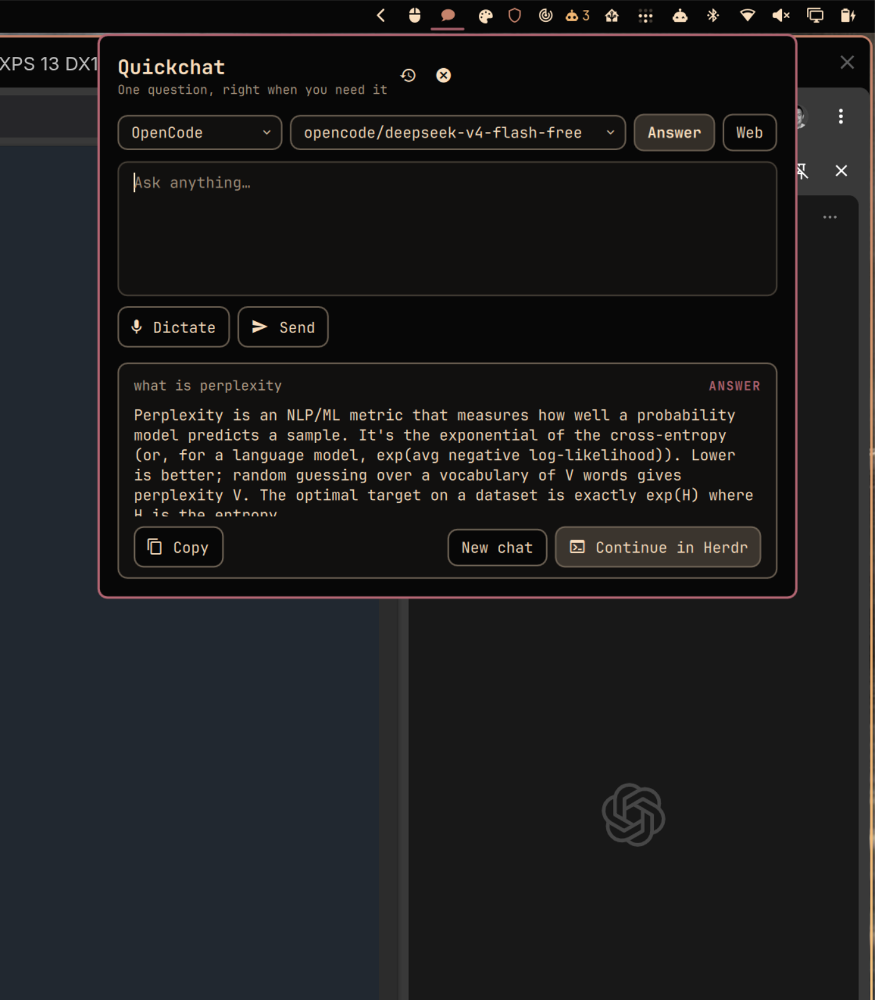

# Omarchy Quickchat

Quickchat is a native [Omarchy Quattro](https://github.com/basecamp/omarchy/tree/quattro) bar widget for fast, disposable AI answers. It uses the Codex, Claude, or OpenCode harness already authenticated on your machine, renders Markdown in a themed panel, remembers the latest 30 completed chats, and can hand an answer to Herdr when you want to keep working.

> [!IMPORTANT]
> Quickchat 0.1.1 is the current release. The remaining marketplace-listing
> approval is tracked in [`TODO.md`](TODO.md).

## Preview



The compact composer expands from the right side of the bar. Its result panel
supports selectable Markdown, code blocks, tables, safe clickable links,
bounded images, Copy, New chat, History, and Continue in Herdr.

## Requirements

- Omarchy Quattro with the native shell plugin architecture.
- Linux x86-64 for the initial prebuilt runtime.
- Node.js 22 or newer for the broker and pinned ACP adapters.
- At least one installed and authenticated harness: `codex`, `claude`, or `opencode`.
- Optional: Voxtype for dictation and Herdr for durable continuation.

Quickchat does not install a harness, log you in, or read provider credentials. Authentication and model availability remain owned by the selected harness. The model picker is populated at startup from Codex's read-only app-server catalog, a non-persisted Claude ACP discovery session, or OpenCode's native catalog; if discovery is unavailable, Quickchat safely falls back to the harness default.

## Install

Review the repository before enabling it: Omarchy plugins execute unsandboxed inside the long-lived shell process.

```bash
omarchy plugin add https://github.com/spencerbull/omarchy-quickchat.git
omarchy plugin validate ~/.config/omarchy/plugins/io.github.spencerbull.quickchat
omarchy plugin enable io.github.spencerbull.quickchat right
```

The Omarchy installer only clones, validates, and enables the plugin. It runs no install hook, `sudo`, package manager, or host-configuration mutation. The reviewed repository revision includes self-contained broker and ACP adapter bundles, so a normal install does not run `npm`, `npx`, or silently download executable code. Git history anchors those checked-in bundles to their TypeScript source and pinned lockfile; release archives add an SBOM, provenance record, and SHA-256 checksum.

Update or remove it with the standard plugin commands:

```bash
omarchy plugin update io.github.spencerbull.quickchat
omarchy plugin remove io.github.spencerbull.quickchat
```

Removal deletes the cloned plugin. Quickchat deliberately leaves user-owned history and cached runtime files in place. Use **Clear all** before removal to erase history and cached chat images. If the plugin is already gone, inspect and remove the `quickchat` directories under your effective `XDG_STATE_HOME` and `XDG_CACHE_HOME` with a file manager; the default locations are `~/.local/state/quickchat` and `~/.cache/quickchat`.

## How it works

```text
Omarchy BarWidget/Panel
        │ one JSON command/event per line
        ▼
Quickchat broker
        │ Agent Client Protocol over stdio
        ├── Codex ACP ── authenticated Codex CLI
        ├── Claude ACP ─ authenticated Claude harness
        └── OpenCode ACP ─ authenticated OpenCode CLI
```

Codex and Claude use exact, source-pinned official ACP adapter packages bundled in the repository. OpenCode uses its native `opencode acp` command. The broker normalizes provider discovery, streamed text/images, cancellation, permissions, errors, and session identities; QML does not parse provider-specific output.

Three capability profiles are exposed:

- **Answer** denies tools, shell, filesystem, MCP, and network capabilities.
- **Web** allows only a harness capability that can be proven to be web search/fetch. It continues to deny shell, filesystem, edits, MCP, and unrelated tools. If the harness cannot enforce that boundary, Web is unavailable.
- **Tools** is available for Codex and Claude with provider-specific boundaries.
  Codex starts read-only and network-disabled, but it may read any file the
  current user can read without asking. Tool output is sent to Codex and may be
  retained in the saved answer. Broader access pauses behind an **Allow once**
  or **Deny** card. An approved Codex command can run outside the read-only
  sandbox and may read or change data or access the network as the current user,
  so the displayed command and working directory must be reviewed. Claude
  instead receives a disposable,
  network-disabled scratch workspace: host paths and credential-bearing
  environment variables are hidden and writes are confined to per-turn scratch.
  Commands inside that fixed Claude boundary may run automatically; any surfaced
  permission still offers only **Allow once** or **Deny** without weakening the
  sandbox. Oversized or visually ambiguous requests, persistent grants,
  arbitrary MCP, browser/computer control, and uninspectable requests remain
  blocked. OpenCode remains on Answer/Web until its ACP path can prove the same
  inspectable approval handshake.

ACP permission requests are denied in Answer and Web. Web access is enabled only
through a provider-specific search/fetch capability that was positively
identified during discovery; it does not turn on shell or filesystem access.
Tools binds supported provider permission decisions to the exact in-flight
request. Quickchat removes its per-turn working directory afterward. Raw tool
requests, decisions, inputs, and outputs are not stored in chat history; the
completed answer can contain tool-derived text and is retained like any other
answer. Quickchat never bypasses a harness permission system.

Exact prompts shaped as **open**, **launch**, or **start** followed by one
installed application name take a separate broker-owned path before ACP. The
broker resolves an exact visible desktop entry and presents its application
name, desktop ID, and resolved path in a default-deny **Allow once** card.
Approval follows Omarchy's own detached app-scope path,
`uwsm-app -- gtk-launch <desktop-id>`; a bounded detached `gio launch` fallback
is used only when that host path is unavailable. Prompt/model text and the
desktop entry's `Exec` field are never interpreted as commands. Missing,
ambiguous, hidden, compound, or malformed targets are not intercepted and stay
inside the selected harness's capability boundary. Local actions are ephemeral:
they do not enter history or offer Continue in Herdr.

## Storage and privacy

Quickchat persists only completed chats, capped at the newest 30. A chat contains the question, rendered answer source, timestamp, provider/model/capability metadata, content references, and a resumable session identity when the harness supplies one. Draft text, authentication output, tokens, environment variables, and provider credentials are not persisted.

| Path | Purpose |
| --- | --- |
| `${XDG_STATE_HOME:-~/.local/state}/quickchat/` | Atomic local history and resumable session metadata |
| `${XDG_CACHE_HOME:-~/.cache}/quickchat/` | Bounded, validated image cache |
| `${XDG_RUNTIME_DIR}/quickchat/` | Per-login sockets, temporary dictation, and in-flight data |

Remote Markdown images are not fetched automatically. Quickchat shows the origin and requires a click before loading a validated HTTPS image. Links are scheme-checked and never interpolated into a shell command. See [`SECURITY.md`](SECURITY.md) for the threat model and reporting process.

## Optional integrations

- **Voxtype:** when `voxtype` is installed and ready, the microphone records directly to a file under `$XDG_RUNTIME_DIR/quickchat`; Quickchat reads that transcript after recording stops. It never simulates keyboard input or modifies Voxtype configuration.
- **Herdr:** when `herdr` is installed, Continue in Herdr launches it when needed or raises its existing window, creates or reuses a dedicated `Quickchat` workspace, creates a labeled tab, closes the Quickchat panel, and focuses the resumed agent pane. It resumes the native harness session when possible, otherwise starts the matching agent with a compact transcript and labels the fallback. This is an explicit handoff from Quickchat's one-shot permission boundary to Herdr's normal native-agent permission model; Codex resumes read-only and asks before commands.

Both integrations disappear or show a clear unavailable state when their command or capability is missing.

## Development

```bash
./scripts/validate.sh
./scripts/package-runtime.sh --dry-run
```

After the broker has been built, assemble a local release artifact without publishing it:

```bash
npm ci
npm run build
./scripts/package-runtime.sh --output-dir dist/release
```

The package helper stages the self-contained checked-in runtime, emits a lockfile-derived CycloneDX SBOM, normalizes timestamps and ownership, creates a deterministic archive, and writes `SHA256SUMS`. Release details and marketplace gates are in [`docs/release.md`](docs/release.md).

## License and attribution

Quickchat is MIT licensed. ACP adapters and bundled dependencies retain their own licenses; see [`THIRD_PARTY_NOTICES.md`](THIRD_PARTY_NOTICES.md) and the generated release SBOM.
